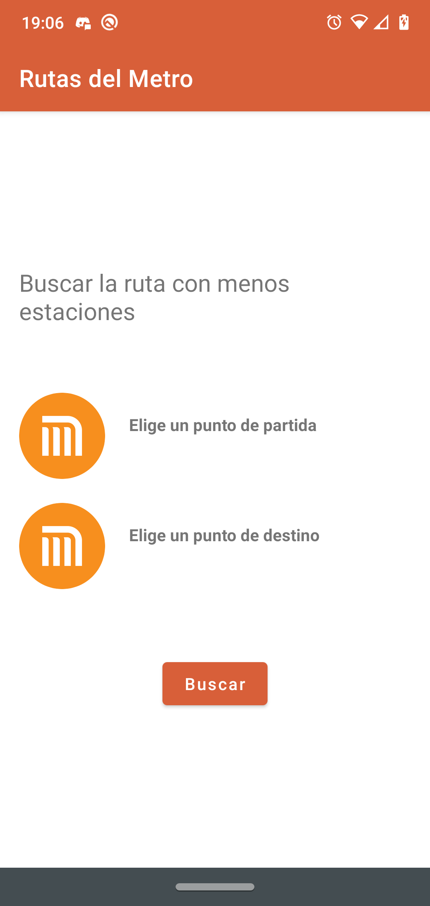

## Rutas del Metro CDMX Android
<!--  -->

Esta aplicación te permite encontrar el camino más corto de una estación a otra sin considerar las distancias o el tiempo entre estaciones.
  
## Demo
  Primero seleciona la estación de partida   

  Despues seleciona la estación de destino   

 
 Al dar click en buscar comenzará la búsqueda y arrojará el resultado  

 

  
## Licencia

| Permisos        | Limitaciones | Condiciones                  |
|-----------------|--------------|------------------------------|
| Uso comercial   | Obligacion   | Aviso de copyright y licencia|
| Modificaion     | Garantia     |                              |
| Distribución    |              |                              |
| Uso privado     |              |                              |
